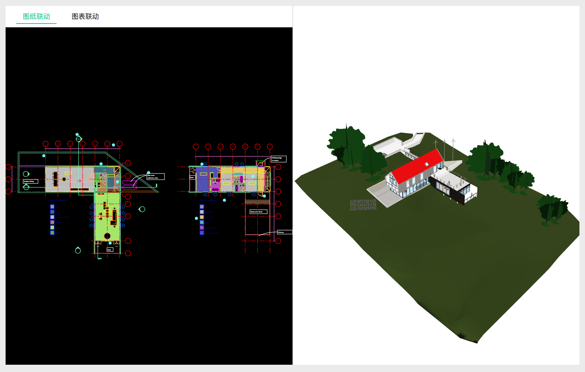
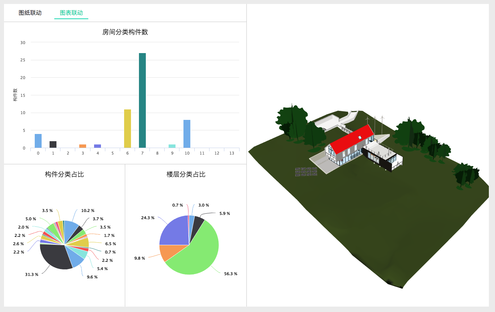

# 功能介绍

基于BIMFACE的拓展功能，可实现二三维场景联动，并且增加图表联动功能。

# 效果图



# 主要逻辑

通过BIMFACE前端JavaScript API灵活使用构建能耗管理应用场景。

# 前端实现

## 引用BIMFACE的JavaScript显示组件库
```javascript
<script src="https://static.bimface.com/api/BimfaceSDKLoader/BimfaceSDKLoader@latest-release.js" charset="utf-8"></script>
```
## 定义DOM元素，用于在该DOM元素中显示模型或图纸
```javascript
<div id="view3d"></div>
<div id="view2d"></div>
```
## 模型初始化
```javascript
var viewToken = this.state.viewToken;
        var options = new BimfaceSDKLoaderConfig();
        options.viewToken = viewToken;
        BimfaceSDKLoader.load(options, successCallback, failureCallback);

        function successCallback(viewMetaData) {
            // 获取DOM元素
            var dom3d = document.getElementById('view3d');

            // 配置参数
            var config = new Glodon.Bimface.Application.WebApplication3DConfig();
            config.domElement = dom3d;
            config.Toolbars = [];

            // 创建viewer3D对象
            window.app = new Glodon.Bimface.Application.WebApplication3D(config);

            // 添加模型
            app.addView(viewToken);

            window.ViewerEvent3D = Glodon.Bimface.Viewer.Viewer3DEvent;

            app.addEventListener(ViewerEvent3D.ComponentsSelectionChanged,function(el){
                var did = viewerDrawing.toDrawingId(el.objectId);
                if(did){
                    viewerDrawing.zoomToObject(did);
                }
            })

            // 监听添加view完成的事件
            app.addEventListener(Glodon.Bimface.Viewer.Viewer3DEvent.ViewAdded, function() {
                // 渲染3D模型
                app.render();
                window.viewer3D = app.getViewer();
                viewer3D.hideViewHouse();

                var options2d = new BimfaceSDKLoaderConfig();
                options2d.viewToken = viewToken;
                options2d.viewType = BimfaceViewTypeOption.DrawingView;
                BimfaceSDKLoader.load(options2d, successCallback2d, failureCallback2d);

                function successCallback2d(viewMetaData) {
                    var dom2d = document.getElementById('view2d');
                    var config2d = new Glodon.Bimface.Viewer.ViewerDrawingConfig();
                    config2d.domElement = dom2d;

                    window.viewerDrawing = new Glodon.Bimface.Viewer.ViewerDrawing(config2d);

                    window.drawingUrl = viewMetaData.drawingUrl;

                    viewerDrawing.load(viewToken,'382617');
                    window.ViewerEvent = Glodon.Bimface.Viewer.ViewerDrawingEvent;
                    viewerDrawing.addEventListener(ViewerEvent.ComponentsSelectionChanged,function(el){
                        if(el && el.length > 0){
                            var rid = viewerDrawing.toModelId(el[0]);
                            viewer3D.clearIsolation();
                            viewer3D.isolateComponentsById([rid], Glodon.Bimface.Viewer.IsolateOption.MakeOthersTranslucent);
                            viewer3D.setSelectedComponentsById([rid]);
                            viewer3D.zoomToSelectedComponents();
                        }
                    })

                }

                function failureCallback2d(error){
                    console.log(error);
                }

            })
        }

        function failureCallback(error) {
            console.log(error);
        };

```
## 用到的JSSDK方法
  * 清除隔离
```javascript
viewer3D.clearIsolation();
```		
  * 隔离构件
```javascript
viewer3D.isolateComponentsById([rid], Glodon.Bimface.Viewer.IsolateOption.MakeOthersTranslucent);
```
  * 选中构件
```javascript
viewer3D.setSelectedComponentsById([rid]);
```
  * 缩放到加入选中集合的构件
```javascript
viewer3D.zoomToSelectedComponents();
```
  * 2D构件转换为3D构件
```javascript
viewerDrawing.toDrawingId(el[0]);
```
  * 3D构件转换为2D构件
```javascript
viewerDrawing.toModelId(el.objectId);
```

## 图表开发

基于highcharts进行开发

## 注

ps. 该Demo基于react+webpack进行开发打包，如用jquery/Vue实现同上。

参考API：[http://doc.bimface.com/book/js/articles/basic/index.html](http://doc.bimface.com/book/js/articles/basic/index.html)

# 查看示例

[http://bimface.com/example/model2d3d](http://bimface.com/example/model2d3d)
